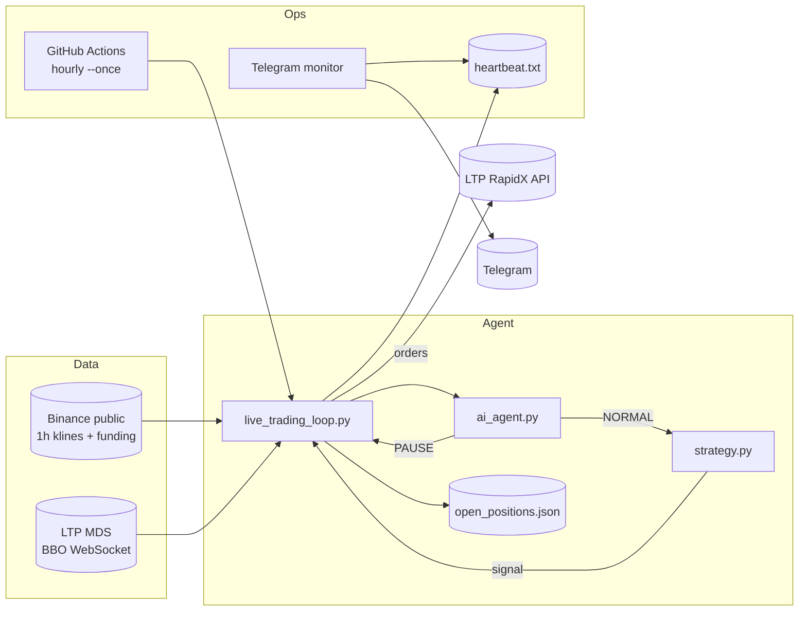

<div align="center">

# RAZER RESEARCH

### Autonomous Capital-Preservation Agent · Liquidity Arena 2026 · Track A

[](https://www.python.org/)
[](https://github.com/adityaraj423582/razer-liquidity-arena)
[](https://api.ltp-contest.com)
[](.github/workflows/trading-loop.yml)

**Survive first. Trade second. Reason always.**

A production-shaped trading agent built for [Liquidity Arena 2026](https://arena.liquiditytech.com): walk-forward research, a rare opportunistic long strategy, an AI regime gate, durable state across serverless runs, and external Telegram monitoring.

</div>

---

## Why this exists

Most competition bots optimize for flashy backtest curves. This one was built the opposite way.

We stress-tested **seven** signal families on multi-symbol walk-forward data. None produced a robust standalone edge. The honest conclusion:

> If you cannot prove direction, you do not fake confidence. You size tiny, enter rarely, cut hard, and keep the account alive.

**RAZER RESEARCH** is a capital-preservation agent with optional AI oversight — not a return-chasing fantasy.

| Principle | Implementation |
|-----------|----------------|
| Rare entries | Cascade dump + funding filter (~few signals per months of history) |
| Hard risk | 1% equity risk per trade · TP +0.5% · SL −1.5% |
| Kill switch | Circuit breaker at **950 USDT** (start 1000); plus 5% UTC daily-loss pause |
| Regime gate | AI `NORMAL` / `PAUSE` before any new entry |
| Fail closed | API / AI failures → **PAUSE** or skip — never force a trade |

---

## System at a glance



---

## Strategy — cascade + funding

Long-only, BTC & ETH perpetuals, flat by default.

**Entry (next bar after cascade):**
1. Prior hour closes down **≥ 4%**
2. Volume **≥ 2×** its 24-bar average
3. Funding in the lower-crowding zone (≤ 20th percentile of recent history)

**Exit / size:**
- Attached take-profit / stop-loss on the entry order
- Notional sized so a stop ≈ **1%** of equity
- Max **2×** leverage (competition cap)
- No new entries while circuit breaker is active or AI returns `PAUSE`

Simulated research outcome on the chosen ruleset: roughly **+0.53% over ~180 days** with near-zero drawdown — intentionally boring. Survival is the edge we can defend.

---

## AI regime gate

`ai_agent.py` exposes a single stable API:

```python
get_regime_assessment(symbol, recent_klines, recent_funding)
# -> {"decision": "NORMAL" | "PAUSE", "reason": str, "timestamp": ISO-8601}
```

| Mode | `AI_BACKEND` | Behavior |
|------|--------------|----------|
| Mock (default) | `mock` | Deterministic vol / funding percentile rules |
| Real | `real` | LTP AI (`MiniMax-M3`) with **fact-anchored** prompts |

Real-backend prompts inject precomputed numbers (last-candle %, volume ratio, vol vs p90) so the model cannot invent “~3% drops” or “elevated vol.” Drift is flagged with a `warning` field in logs + audit JSONL.

---

## Architecture

```
razer-liquidity-arena/
├── live_trading_loop.py      # Hourly live loop / --once for Actions
├── strategy.py               # Cascade+funding signal + sizing + breaker
├── ai_agent.py               # Regime gate (mock | real)
├── open_positions.json       # Persisted re-entry block (API-verified on load)
├── monitor/
│   ├── heartbeat_monitor.py  # External Telegram watchdog
│   └── telegram_alert.py
├── .github/workflows/
│   └── trading-loop.yml      # Scheduled hourly run + log commit-back
├── backtesting/              # Walk-forward research scripts
├── multi_strategy/           # Extended universe sweeps
├── testing/                  # Connection / MDS / orders / AI smoke tests
├── audit/                    # Dated AI decision JSONL
└── data/                     # Local CSVs (gitignored)
```

### Stateless-run safety

GitHub Actions containers start empty each hour. This stack persists what matters:

| Artifact | Role |
|----------|------|
| `open_positions.json` | Blocks re-entry; verified against live order status on startup |
| `heartbeat.txt` | Liveness timestamp for the Telegram monitor |
| `live_trading.log` / `ai_decisions.log` / `audit/*.jsonl` | Forensic trail (committed back by the workflow) |

---

## Quick start

### 1. Clone & install

```bash
git clone https://github.com/adityaraj423582/razer-liquidity-arena.git
cd razer-liquidity-arena
python -m venv .venv
# Windows: .venv\Scripts\activate
source .venv/bin/activate
pip install -r requirements.txt
```

### 2. Configure secrets locally

Copy `.env.example` → `.env` (never commit `.env`):

| Variable | Purpose |
|----------|---------|
| `LTP_ACCESS_KEY` / `LTP_SECRET_KEY` | Trading API |
| `LTP_API_HOST` | e.g. `https://api.ltp-contest.com` |
| `LTP_AI_API_KEY` | AI only — separate from trading keys |
| `AI_BACKEND` | `mock` (safe default) or `real` |
| `TELEGRAM_BOT_TOKEN` / `TELEGRAM_CHAT_ID` | External alerts |

### 3. Smoke tests

```bash
python testing/test_connection.py
python testing/test_marketdata.py
python testing/test_ai_api.py --connectivity   # spends 1 AI call
python live_trading_loop.py --once            # one supervised iteration
```

### 4. Continuous local loop

```bash
python live_trading_loop.py                   # hourly cadence
# Optional external monitor (separate process):
python monitor/heartbeat_monitor.py
```

### 5. GitHub Actions (hourly)

Workflow: [`.github/workflows/trading-loop.yml`](.github/workflows/trading-loop.yml)

Add repository secrets matching `.env.example`, then use **Actions → Trading Loop → Run workflow** for a manual dry run before relying on the cron schedule.

---

## Risk controls (non-negotiable)

```
Equity start ........ 1000 USDT (demo / sandbox)
Circuit breaker ..... 950 USDT  → no new entries
Daily loss pause .... 5% below UTC day-start equity → no new entries until next UTC day
Disqualification .... 800 USDT  → competition floor (reference)
Risk per trade ...... 1% base risk, sized at EFFECTIVE_LEVERAGE 1.5x (account cap 2x)
AI / API failure .... PAUSE / skip — never fail open to NORMAL
```

Orders are LIMIT with attached TP/SL. Symbols stay blocked while a tracked entry order is live or filled (tp/sl managed), with state reconciled to the exchange — not blindly trusted from disk.

---

## Research trail

Walk-forward work lived under `backtesting/` and `multi_strategy/`:

- Mean reversion, momentum, cross-sectional RS  
- Funding extremes, long-horizon trend  
- Cascade reversal, cascade + funding combo  
- Multi-family sweeps on a larger universe  

**Result:** no robust standalone edge → ship the capital-preservation design above. The research scripts remain in-repo for auditability.

---

## Design principles

1. **Honesty over theater** — publish what failed, not only what shipped  
2. **One public entry point for AI** — swap backends without rewriting the loop  
3. **Fail closed** — uncertainty means no new risk  
4. **Observable** — heartbeat, audits, Telegram, Actions logs  
5. **Stateless-ready** — persist the few bytes that keep re-entry safe  

---

## Disclaimer

This repository is a **competition / research** trading agent for Liquidity Arena 2026 (Track A) on LTP sandbox / RapidX infrastructure. It is **not** financial advice. Crypto perpetual trading is high risk. Past simulated results do not predict future performance. Run at your own risk; keep secrets out of git.

---

<div align="center">

**RAZER RESEARCH** — *capital first, conviction second*

[Repository](https://github.com/adityaraj423582/razer-liquidity-arena) · Built for Liquidity Arena 2026

</div>
